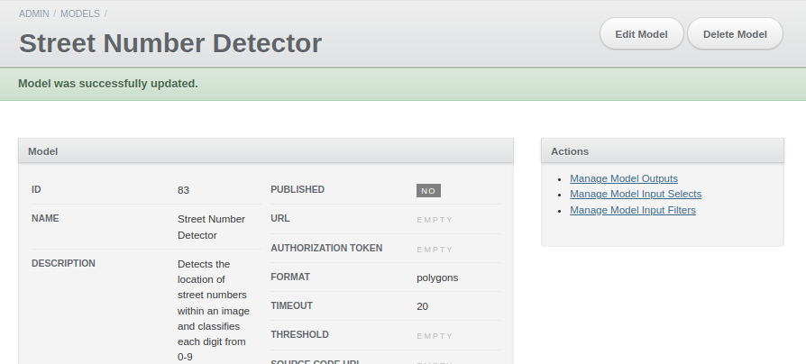
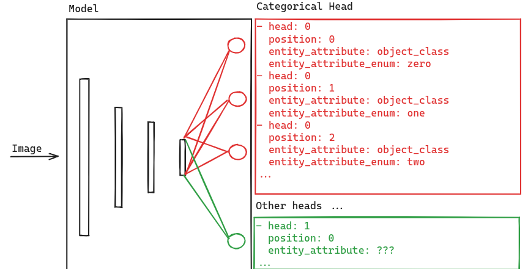

+++
title = "Creating your first assessment capability"
description = "A tutorial on how to create your first assessment capability, add it to an agent and run in an assessment process"
date = 2021-05-01T08:00:00+00:00
updated = 2021-05-01T08:00:00+00:00
draft = false
weight = 400
sort_by = "weight"
template = "docs/page.html"

[extra]
lead = "A tutorial on how to create your first assessment capability, add it to an agent and run in an assessment process"
toc = true
top = false
+++

## Overview

The following tutorial will walk you through creating an *Assessment Capability* in
Highlighter. Each step in this tutorial can by carried out in you Highlighter
account. Although we will be building a toy example, the tutorial wll link to
other explanations/references as needed.

## Prerequisites

  - **Labelled data**: For this tutorial we will be using a Street Number
detection dataset. To import it into your account click [here](ToDo). Otherwise
you can just follow along and fill-in-the-blanks with your own data.

## What Is An *Assessment Capability*

> Assessments tasks are sub-tasks of a larger assessment process that an organisation wishes to carry out.

More information on Capabilities [here](../concepts/capabilities.md#assments)

## Steps

1. [Identify The Taxonomy](#identify-the-taxonomy) and create as needed
2. [Create A Model](#create-a-model) that outputs the desired taxa

## Identify The Taxonomy

When working in an extablished account you may have an existing taxonomy
defined. In this case you may be able to skip to the [Create A
Model](#create-a-model) step.

For this tutorial we will be creating a street number detector. The detector
will take images as input and return an enum attribute indicating the digit
(0-9) and a pixel location attribute. For example:

For this we will need to create 10 *Object Classes* in Highlighter to represent each
digit. 

1. Click the *Taxonomy* tab on the Highlighter side bar
2. Click the *New Object Class* button
3. Fill in the form (using Zero as an example):
  - `Name = Zero`
  - `Description = The digit zero`
  - `Color = YOU CHOOSE`
  - `Include in projects by default? = UNCHECK`
4. Click *Save Object Class*

## Create A *Model*

A *Model* in Highlighter represents a transformation from some input to some
output. Importantly, it does not specify *how* the transformation is performed.
For the programmers among you, a *Model* serves as an Interface.

**Create a new _Model_**

  - `Capabilities->Models->New Model`
  - `Name = Street Number Detector`
  - `Description = Detects the location of street numbers within an image and classifies each digit from 0-9`
  - **Leave the rest of the fields as is. We are currently in the process of refactoring this part of Highlighter and need to do some cleaning up.**
  - Click `Create Model`
  - Stay on this page for the next steps

### Model Inputs

The *Model*'s inputs serve two functions depending on where they're being used.
At training time they inform the Dataset manipulations needed to convert the 
Highlighter Dataset Submissions into a form the model Trainer can use. At
inference time they tell the Pipeline what data to pass to the model. For more
information about Model Inputs see [here](../concepts/model-inputs-and-outputs.md).

In our case the *Model* we're creating is a Detector. It takes images as an
input. At the moment an input image is assumed. Also, a Detector expects a full
image so no filtering is required.

### Model Output

The *Model*'s outputs also serve two functions depending on where they're being
used. At training time that are used in conjunction with the Model Inputs to
convert the Highlighter Dataset Submissings into a form the model Trainer can use.
At inference time they tell the Pipeline what attribtues the Pipeline Element
is producing.

In our case we're creating a single headed *Model*. With `head 0` producing 10
*Object Class* attributes (one for each digit 0-9) and a pixel location
attribute representing the bounding box contaning each digit.

**At the moment the pixel_location attribute is infered within the code and has
not been made explicit so we need only add the *Object Class* attributes to the
Model Outputs.**.

**Add Model Outputs**

  - From the Model page, do this page once for each digit 0-9
  - `Manage Model Outputs->New Model Output`
  - `Head = 0`
  - `Position = 0`  *increment for each digit 0-9*
  - `Entity Attribute = object_class`
  - `Entity Attribute Enum = zero` *select the appropriate object class*
  - `Default Threshold = 0.5`
  - Click `Create Model Output`
